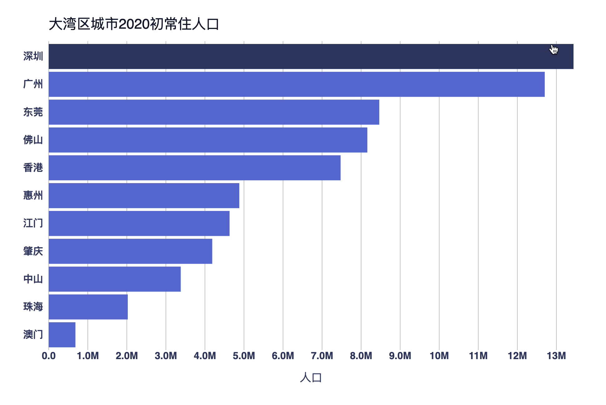

# Great Bay Area City Population 2020 大湾区城市常住人口 
以网上搜索到的非官方或官方统计数字为范例样本，使用 D3.js 绘制大湾区9⃣市人口2020年人口总数柱状图。

This repository used [rollup.js](https://rollupjs.org/) as the JavaScript module bundler.

## Screenshot


## Source
香港及澳门数据为其政府统计处2020年底最新数据，其他广东七市数据透过媒体或政府概要收集的2019年底至2020年初的粗略数据，仅供图表绘制练习使用，数据定存在一定偏差，仅供参考。
* 香港: [政府統計處](https://www.censtatd.gov.hk/hkstat/sub/so150_tc.jsp)
* 澳門：[統計暨普查局](https://www.dsec.gov.mo/getAttachment/d1b0ae76-b589-47cc-8594-8ba06590708c/C_DEM_FR_2020_Q4.aspx)

## View the outcome
Open `public/index.html` in modern browser such as Chrome or Firefox directly. 

## Further development
To further develop the project by updating JavaScript, can run

```javascript

npm run bulid

```

or **watch** changes and auto compile:
```javascript
npm run watch
```

### Note for rollup.config.js settings
The output file format must be 'iife' to make advanced function work. 